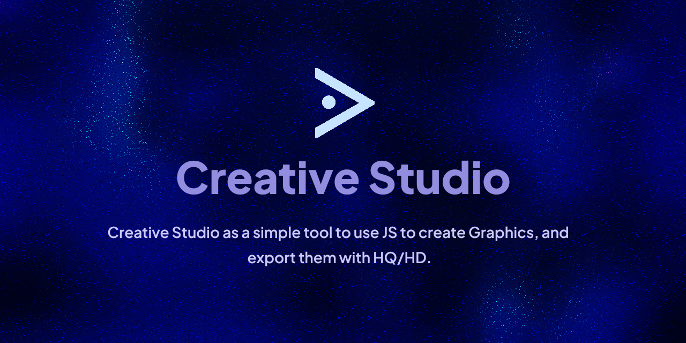

<p align="center">
    
</p>
# Creative Studio (v3)

Creative Studio is a user-friendly tool designed for coding JavaScript web-based graphics. Its primary goal is to facilitate quick switching between different JavaScript 'workers' while offering support for various libraries and useful features, such as high-definition (HD) and high-quality (HQ) screenshots.

## Table of Contents
- [Features](#features)
- [About Feature Requests](#about-feature-requests)
- [Getting Started](#getting-started)
- [Notes](#notes)
- [License](#license)

## Features

- **Fast Switching with enabledJS.json**  
  Easily switch workers and libraries on and off in seconds by toggling a boolean for each element.

- **Library Support**  
  Enjoy support for various libs. (Oh also JQuery 6.3.0 is included.)

- **Real-Time Previewer**  
  Utilize the built-in previewer to see your changes in real-time. (Just remember to enable it!)

## About Feature Requests

While I appreciate all suggestions, please note that I may not develop features that I don't find necessary. However, contributions are always welcome! If you have an idea for a feature or improvement, feel free to submit a pull request.

## Getting Started

To get started with Creative Studio, please follow these steps. Before making any changes, be sure to read the [Notes](#notes). Thank you!

### Prerequisites:
```bash
pip install selenium
```
Make sure to download your own Chromium Driver. You can find it here: [chromium.org/driver](https://sites.google.com/chromium.org/driver/downloads).

1. Clone the repository: 
   ```bash
   git clone https://github.com/true1ann/cs
   ```
2. Start the server:
   ```bash
   npm run server
   ```
3. Open [localhost:65069/csv3.html](http://localhost:65069/csv3.html) to view the preview.
4. To capture a high-quality screenshot:
   ```bash
   npm run ss
   ```
5. To stop the server, simply press `^C` (CTRL+C).

## Notes

1. You can change the resolution (base + resolution multiplier) by editing `resconfig.json`.
2. Enable real-time preview by clicking the appropriate button in `csv3.html`.
3. **Important:** DO NOT use `content.html`! It is NOT intended for previewing, as it may display incorrect resolutions. The preview can be inaccurate compared to the screenshot output. Use `content.html` only to check for context-specific errors or to debug instantly with DevTools.

## License

This project is licensed under the GNU GPLv3 License. For more details, please refer to the LICENSE file. Thank you for your interest in Creative Studio!
